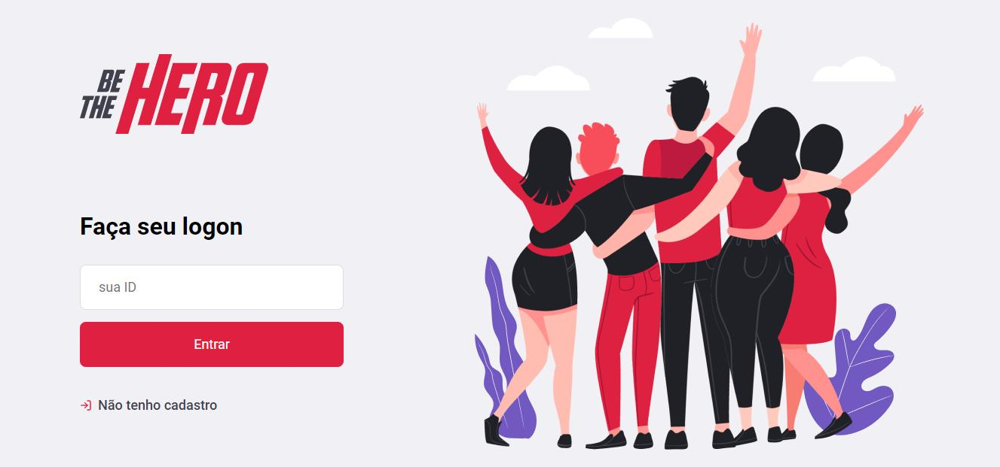

<h1 align="center">
  Semana Omnistack 11: Be The Hero
</h1>

<h1 align="center">
    
</h1>

## :rocket: Sobre o projeto
Be the Hero é uma aplicação web e mobile que foi construída durante a semana OmniStack, promovida pela Rocketseat e tem como objetivo oferecer um suporte para ONGs fazerem pedidos de auxílio em doações. Na aplicação Web a ONG se cadastra para obter um id de acesso ao sistema web, já logada ela cadastrar os casos em que necessita de ajuda, informando a descrição do caso e o valor que necessita arrecadar.

No mobile os usuários podem visualizar casos de diversas Ongs e entrar em contato via WhatsApp ou E-mail com a ONG informando caso tenha interesse em ajudar.

## :computer: Tecnologias usadas:

### Backend:

- `NodeJS`: Para criação da API;

- `ExpressJS`: Utilizado para a criação das rotas da aplicação;

- `Knex`: Query Builder usado para criar instruções em SQL para o banco;

- `Jest`: Para testes unitários;

- `Supertest`: Para testes de integração;

- `Celebrate`: Para validação dos campos.

### Banco de dados:
- `SQLite`: Base de dados da aplicação.

### ReactJS:

- `Axios`: Utilizado para acessar a API do nosso projeto;

- `reactJS, react-dom, react-scripts`: Para podermos acessar os elementos HTML, a árvore de elementos e alguns scripts para a nossa aplicação no ReactJS.

### React Native:
- `Expo`: Para acessar os recursos da SDK do Android;
- `Axios`: Utilizado para acessar a API do nosso projeto;
- `React Native Navigation`: Para navegar entre as páginas da aplicação.

## :bulb: Telas

### Web

### Mobile
